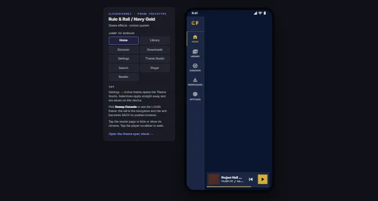

# CleverFerret Design System

Design repo for CleverFerret — the theme system and interactive prototypes for the
[CleverFerret](https://github.com/Kaleaon/CleverFerret) media library app.



## Live prototypes (GitHub Pages)

Once Pages is enabled for this repo (see below), the mockups are served from:

- **App Prototype** — `docs/app.dc.html` — nine navigable screens (Home, Library, Discover,
  Search, Player, Reader, Settings, Downloads, Theme Studio) with real navigation and state.
- **Theme System** — `docs/theme-system.dc.html` — the full token spec sheet: layout packs,
  colour families, effects, motion and reader modes, previewed across phone/tablet/TV.
- **Landing page** — `docs/index.html` — links to both, plus the screen-to-source map.

Locally, open `docs/index.html` in a browser (or run any static file server, e.g.
`python3 -m http.server` from `docs/`) — everything is static HTML/CSS/JS, no build step.

## Enabling GitHub Pages (one-time setup)

This repo doesn't have Pages turned on yet — that setting can only be changed by a repo admin
in the GitHub UI. `.github/workflows/pages.yml` builds and deploys `docs/` on every push to
`main`, but the Pages *source* still has to be set once:

1. Go to **Settings → Pages** on `github.com/Kaleaon/Cleverferret-design`.
2. Under **Build and deployment → Source**, choose **GitHub Actions**.
3. After merging this branch to `main`, the workflow runs and the site publishes at
   `https://kaleaon.github.io/Cleverferret-design/`.

## How the prototypes work

The `.dc.html` files are self-contained interactive documents rendered by `docs/support.js`
(a small React-based runtime, loading React/ReactDOM/Babel from a CDN at view time). They need
no server-side code — any static host, including GitHub Pages, serves them as-is.

## Repo layout

```
docs/                    GitHub Pages site root
  index.html             landing page
  app.dc.html            phone app prototype (9 screens)
  theme-system.dc.html   theme/token spec sheet
  support.js             prototype runtime (shared by both .dc.html files)
  assets/                images used by the landing page
design-notes/
  sync-log.md            design/source sync notes from the CleverFerret app repo
```

## Related repos

- App source: [Kaleaon/CleverFerret](https://github.com/Kaleaon/CleverFerret)
- Palette/layout reference: Kaleaon/linkpoint-design, Kaleaon/Ktheme
